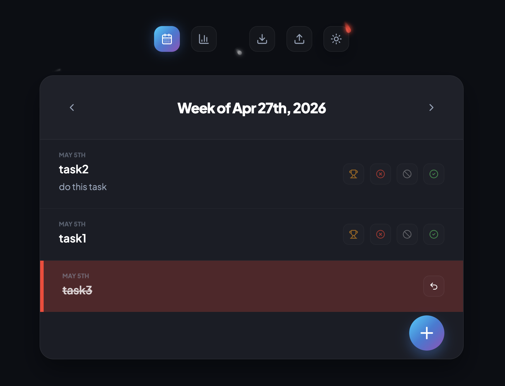

# Simple Work Tracker



A simple tracker, that helps at review time. Track your tasks and mark them as Win, Lose, Cancelled or Complete. At review time uses the stats to generate bullet points for your review.

Fully vibe coded!


## ✨ Features

- **Weekly Deep Work Tracking**: Focused weekly view with fluid sliding transitions and keyboard navigation (`ArrowLeft`/`ArrowRight`).
- **Status-Driven Workflow**: Categorize your outcomes as **Win**, **Complete**, **Lose**, or **Cancelled**.
- **Performance Analytics**: Interactive stats dashboard with drill-down modals. Click any stat to see exact task details and copy them to your clipboard in a professional format.
- **Local-First & Portable**: Built on **SQLite** for speed and privacy. Export or Import your entire database with a single click.
- **Keyboard Optimized**: Quick task entry and navigation designed for power users.

## 🚀 Tech Stack

- **Framework**: Next.js 14 (App Router)
- **Database**: SQLite (via `better-sqlite3`)
- **Animations**: Framer Motion
- **Styling**: Vanilla CSS (Modules) with a custom Design System
- **Icons**: Lucide React
- **Date Logic**: date-fns

## 🛠️ Getting Started

### Prerequisites

- Node.js 18.x or later
- npm or yarn

### Installation

1. Clone the repository:
   ```bash
   git clone https://github.com/gmumar/simple-task-tracker.git
   cd simple-task-tracker
   ```

2. Install dependencies:
   ```bash
   npm install
   ```

3. Run the development server:
   ```bash
   npm run dev
   ```

4. Open [http://localhost:3000](http://localhost:3000) in your browser.

## 📂 Project Structure

- `/src/app`: Next.js App Router, API routes, and Server Actions.
- `/src/components`: Core UI components including `WeekView`, `StatsView`, and the `SpaceBackground` animation.
- `/src/lib`: Database configuration and initialization.
- `/public`: Static assets.

## 💾 Database Management

The application stores all data in a local `work-tracker.sqlite` file. 

- **Export**: Use the download icon in the toolbar to save your database file.
- **Import**: Use the upload icon to restore a previously exported `.sqlite` file.

## 📄 License

MIT

---

Built with 🌌 by [Antigravity](https://github.com/features/copilot)
